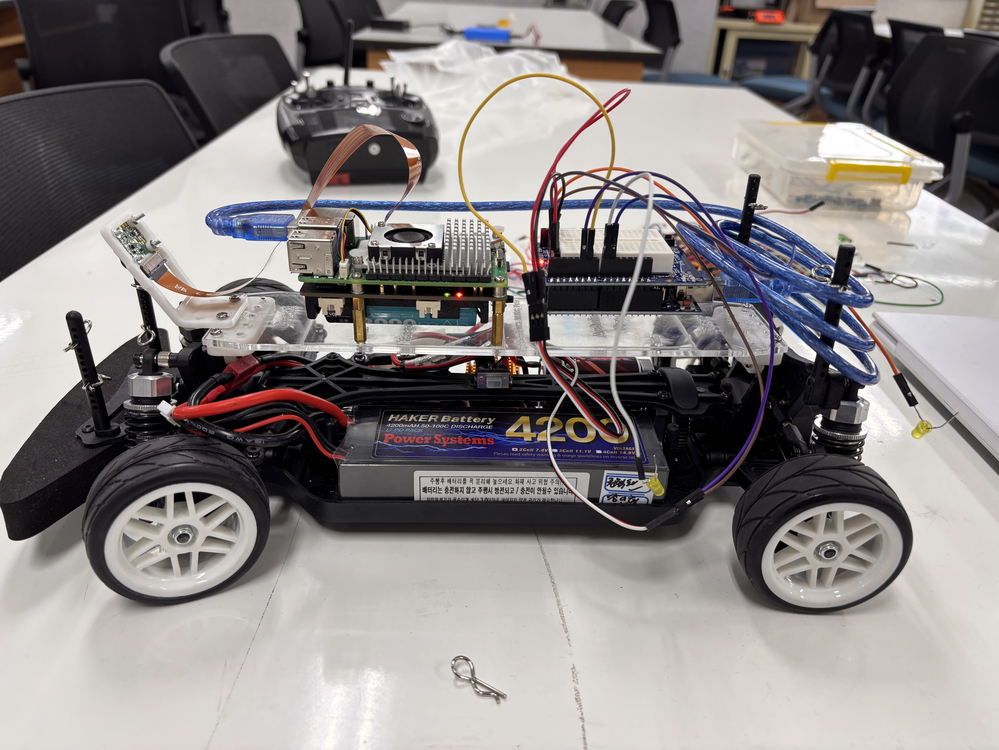
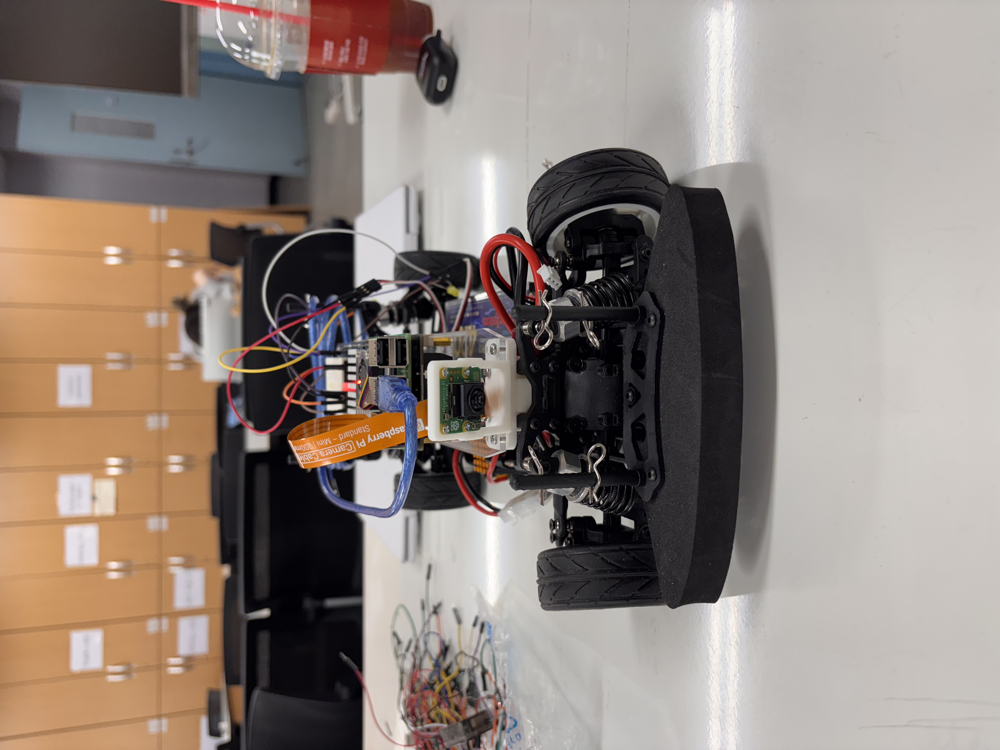
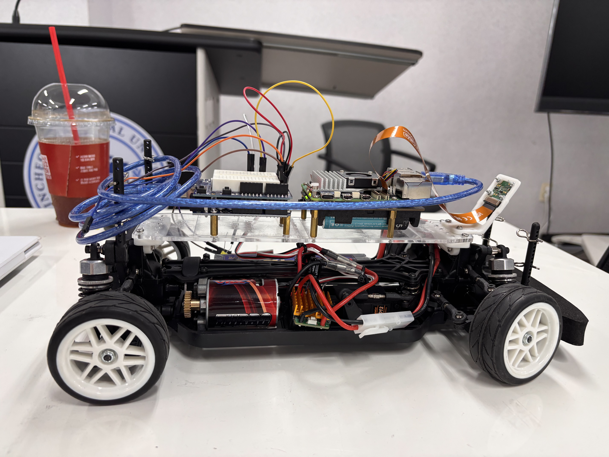
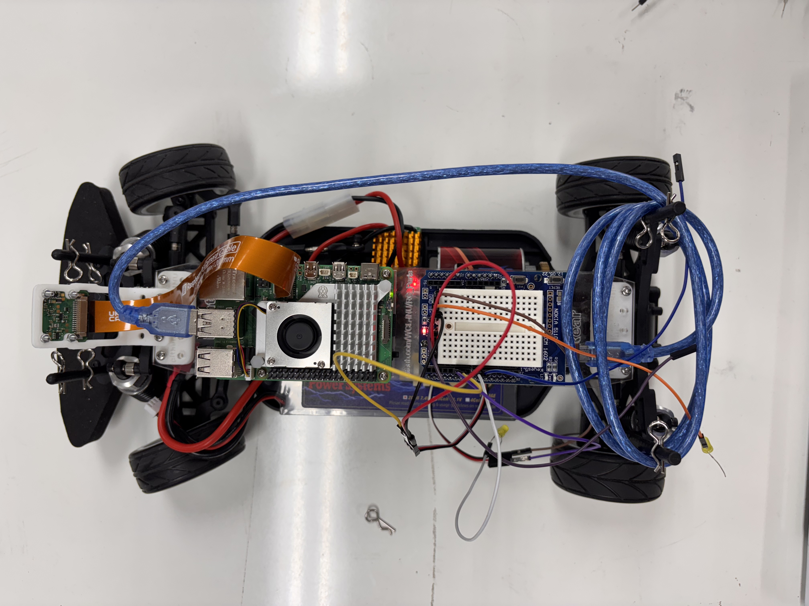
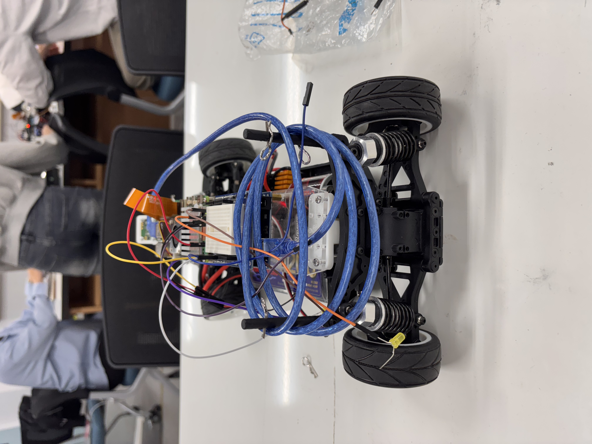

# RC Car Control System
[프로젝트 동영상 보기](https://youtube.com/shorts/QKLbzcTRWrM?si=A8T2E5wDIquX8eq8)

**Team Members**  
- 권혁찬: Raspberry Pi 코드 및 하드웨어 담당  
- 장민혁: Arduino 코드 및 RC 카 하드웨어 담당  

---

## 목차
1. [프로젝트 개요](#프로젝트-개요)  
2. [차 사진](#차-사진)
3. [시스템 요구사항](#시스템-요구사항)  
4. [파일별 동작 원리](#파일별-동작-원리)  
   - [auto.cpp](#autocpp)  
   - [remote.cpp](#remotecpp)  
   - [rc_car.py](#rc_carpy)  
5. [이미지 처리 및 라인트레이싱 제어 방법](#이미지-처리-및-라인트레이싱-제어-방법)  
6. [라즈베리파이 ↔ 아두이노 통신 프로토콜](#라즈베리파이-아두이노-통신-프로토콜)  
7. [설치 및 실행 방법](#설치-및-실행-방법)  
8. [라이선스](#라이선스)   

---

## 프로젝트 개요
Arduino와 Raspberry Pi를 기반으로 RC 카를 **원격(remote)** 및 **자율(autonomous)** 주행으로 제어하는 하이브리드 시스템입니다.

- **원격 모드**: RC 수신기(PWM) 또는 시리얼 명령으로 모터·서보·LED 제어  
- **자율 모드**: PiCamera2와 OpenCV를 활용한 라인트레이싱 기반 주행  

---

## 차 사진











---

## 시스템 요구사항
- **Arduino IDE** ≥ 1.8.15  
- **Raspberry Pi OS** (32-bit) ≥ Bullseye  
- **Python** ≥ 3.7  
- **라이브러리**  
  - Arduino: `Servo.h`  
  - Raspberry Pi: `picamera2`, `opencv-python`  

---

## 파일별 동작 원리

### auto.cpp
- **목적**: 시리얼 명령(`F`, `S`, `L`, `l`, `C`, `r`, `R`, `X`)으로 ESC(DC 모터)와 조향 서보 제어  
- **핵심 기능**  
  - `shortForward()` / `shortBackward()`: 0.15초간의 전진/후진  
  - `lastSteer` 변수로 마지막 조향값 저장 → `X` 명령에서 반대 조향  
  - 안전 정지(`S`), 중앙 정렬(`C`)  
- **핵심 핀**  
  - D5: ESC (PWM 출력)  
  - D6: Servo (PWM 출력)  

### remote.cpp
- **목적**: RC 수신기(PWM) 입력 → ESC, 조향 서보, LED 방향지시등 제어  
- **핵심 기능**  
  - `pulseIn()`으로 채널2(D3), 채널5(D2) PWM 읽기  
  - `map(1000–2000 → 1300–1700)`으로 ESC 속도 제한  
  - 조향 각도에 따라 좌/우 LED(D9/D8) 0.1초 간격 5회 점멸  
- **핵심 핀**  
  - D2: Speed PWM 입력  
  - D3: Steer PWM 입력  
  - D5: ESC PWM 출력  
  - D6: Servo PWM 출력  
  - D8/D9: LED 출력  

### rc_car.py
- **목적**: PiCamera2 영상 처리 → 시리얼 명령 생성 → 아두이노 자율 주행  
- **핵심 기능**  
  1. 320×240 해상도 캡처 → 하단 100px ROI  
  2. 그레이스케일 변환 + 임계값 이진화(`threshold=110`)  
  3. 모멘트로 선 무게중심(cx) 계산  
  4. `offset = cx - width/2` 기준 5단계 조향(`L, l, C, r, R`)  
  5. 프레임당 `F` 전진 유지, 미검출 시 `S` 정지  
  6. 동일 명령 중복 전송 방지 로직  
- **시각화**: `cv2.imshow()`로 원본/ROI 및 중심점 표시  

---

## 이미지 처리 및 라인트레이싱 제어 방법
1. **ROI 설정**: 영상 하단 100px → 노이즈 최소화  
2. **그레이스케일 → 이진화**  
   ```python
   gray = cv2.cvtColor(frame, cv2.COLOR_BGR2GRAY)
   _, binary = cv2.threshold(gray, 110, 255, cv2.THRESH_BINARY_INV)
모멘트 계산

python
복사
편집
M = cv2.moments(roi)
cx = int(M["m10"] / M["m00"])
오프셋 기반 5단계 조향

offset 범위	명령	의미
< -40	L	강한 왼쪽
-40 ≤ offset < -15	l	약한 왼쪽
|offset| ≤ 15	C	중앙 정렬
15 < offset ≤ 40	r	약한 오른쪽
> 40	R	강한 오른쪽

전진 유지: 매 프레임 F 전송

예외 처리: 선 미검출 시 S 전송 → 모터 정지

## 라즈베리파이 아두이노 통신 프로토콜
통신 방식: UART 시리얼 (9600 bps, 8N1)

전송 형식: 1바이트 ASCII 문자

명령 및 설명

코드	동작
F	전진 (0.15초 Forward)
S	정지
C	조향 중앙 정렬
L	강한 왼쪽 조향
l	약한 왼쪽 조향
R	강한 오른쪽 조향
r	약한 오른쪽 조향
X	반대 조향 후 짧은 후진

전송 타이밍:

최소 20ms 간격 권장 (아두이노 내부 딜레이 포함)

동일 명령 중복 시 아두이노 처리가 지연될 수 있어, Python 코드에서 중복 방지 로직 구현

## 설치 및 실행 방법
Arduino

bash
복사
편집
# Arduino IDE에서 auto.cpp 또는 remote.cpp 업로드
Raspberry Pi

bash
복사
편집
sudo apt update
sudo apt install python3-opencv python3-picamera2
pip3 install opencv-python
python3 rc_car.py
## 라이선스
MIT License

누구나 소프트웨어를 자유롭게 사용, 복사, 수정, 병합, 배포, 판매할 수 있으며,
저작권 표시와 라이선스 문구를 포함해야 합니다.
소프트웨어는 "있는 그대로" 제공되며, 사용에 따른 책임은 사용자에게 있습니다.